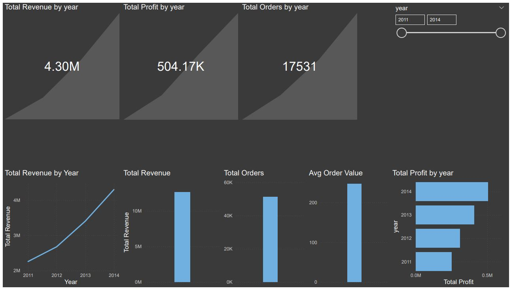
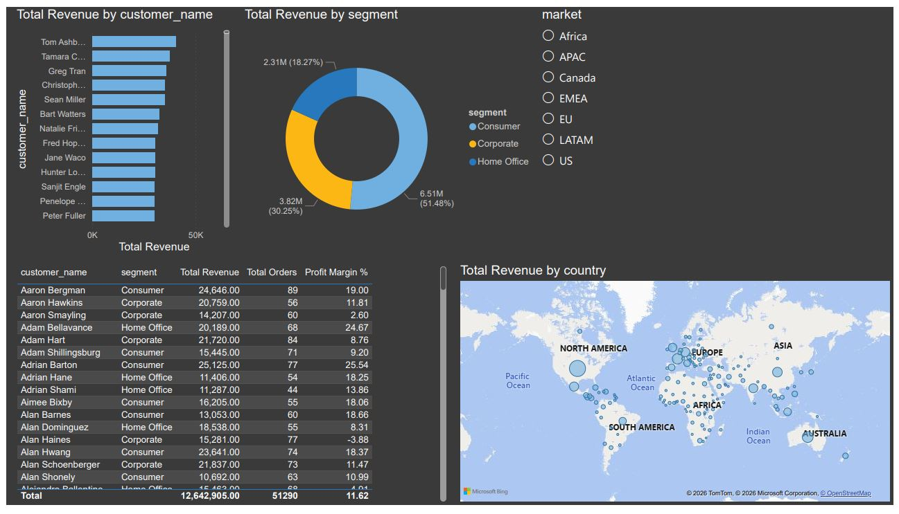
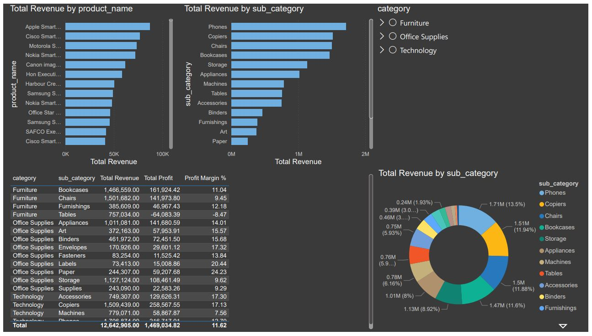
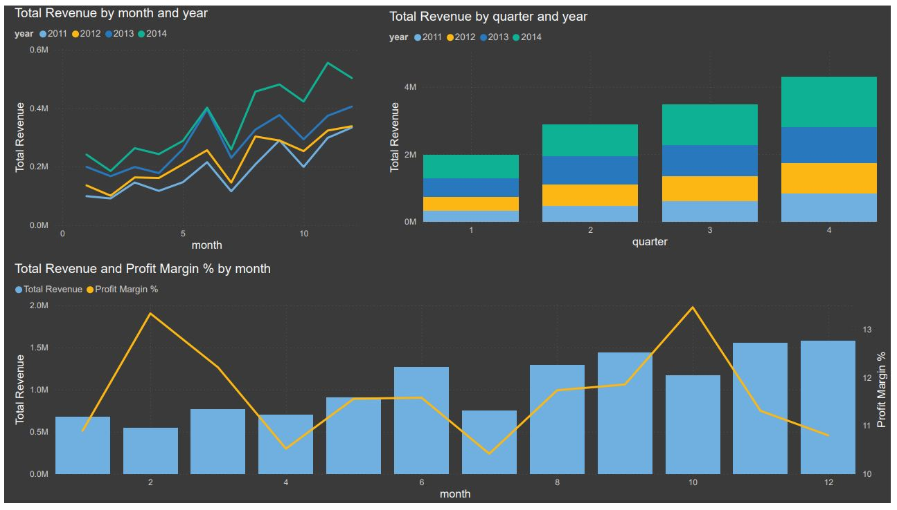

# Retail Data Warehouse — Superstore Orders

A full end-to-end data warehouse project built on a global retail dataset.
Covers ingestion, cleaning, dimensional modelling, and BI reporting across 51,290 orders and $12.6M in revenue.

---

## Live Demo

**[Streamlit App](https://jpaic-retail-data-warehouse.streamlit.app)**

> **Note:** The Streamlit app reads directly from a CSV via pandas and is not connected to the PostgreSQL database. It's a standalone interactive showcase of the same dataset - the full DWH project (star schema, ETL pipelines, Power BI) exists only locally and is documented below.

---

## Technologies Used

| Layer | Tool |
|---|---|
| Database | PostgreSQL |
| ETL | SQL (pgAdmin) |
| BI Dashboard | Power BI |
| EDA | Python, pandas, matplotlib |
| Version Control | Git / GitHub |

---

## Architecture

```
CSV Source
    │
    ▼
raw.orders              ← All fields stored as TEXT, no transformations
    │
    ▼
staging.orders_clean    ← Typed, deduplicated, null-checked
    │
    ▼
marts.dim_*             ← Dimension tables (customers, products, geography, date)
marts.fact_sales        ← Fact table at order-line grain
    │
    ▼
Power BI Dashboard      ← 4-page analytical report
```

---

## Star Schema

```
                    dim_date
                       │
dim_customers ── fact_sales ── dim_products
                       │
                 dim_geography
```

| Table | Grain | Key |
|---|---|---|
| `fact_sales` | One row per order line | `sales_key` |
| `dim_customers` | One row per customer + segment | `customer_key` |
| `dim_products` | One row per product ID | `product_key` |
| `dim_geography` | One row per state/country/region/market | `geography_key` |
| `dim_date` | One row per calendar date | `date_id` |

---

## ETL Process

### 1 — Ingestion (`sql/schema/`)
Raw CSV loaded into `raw.orders` via pgAdmin import. All 21 columns stored as `TEXT` to avoid type errors on load. No transformations applied at this stage.

### 2 — Staging (`sql/staging/`)
Three scripts run in sequence:

- **`03_raw_to_staging.sql`** — Casts all fields to correct types. Dates parsed from `DD/MM/YYYY`. Numeric fields stripped of commas before casting (`REPLACE(sales, ',', '')`). Empty strings converted to `NULL` via `NULLIF`.
- **`04_duplicate_removal.sql`** — Removes true duplicates matched on `order_id + product_id + order_date + sales + quantity`. Single-product multi-line orders are preserved.
- **`05_missing_values.sql`** — Validation check for nulls in critical fields (`order_id`, `customer_name`, `sales`).

### 3 — Dimensional Modelling (`sql/marts/`)
- **`06_star_schema.sql`** — Creates all fact and dimension tables with surrogate keys (`SERIAL PRIMARY KEY`).
- **`07_load_dimensions.sql`** — Populates dimension tables. Products deduplicated with `GROUP BY product_id` + `MIN()` to handle name variations in the source. Geography uses `(state, country, region, market)` as the natural key — no city field exists in the source data.
- **`08_load_fact_sales.sql`** — Loads fact table with `JOIN` to all four dimensions. All joins verified as 1:1 to prevent fan-out.

### 4 — Dashboard Views (`sql/dashboard/`)
- **`10_dashboard_views.sql`** — Four pre-aggregated views (`vw_sales_overview`, `vw_customer_analytics`, `vw_product_analytics`, `vw_time_analysis`) to simplify the Power BI model and push aggregation logic into SQL.

---

## Data Quality Validation (`sql/validation/`)

All checks passed after pipeline completion:

| Check | Result |
|---|---|
| Raw → Staging row count | ✅ Match |
| Staging → Fact row count | ✅ 51,290 rows |
| Revenue reconciliation | ✅ $12,642,905 |
| Orphan keys in fact table | ✅ None |
| NULL surrogate keys | ✅ None |

---

## Dashboard Insights

Built in Power BI across 4 pages. Connected directly to PostgreSQL via the pre-aggregated mart views.

### Page 1 — Sales Overview


- **Total Revenue:** $12,642,905
- **Total Orders:** 51,290
- Revenue grew consistently year-over-year with peak performance in 2014.

### Page 2 — Customer Analytics


- **APAC** is the highest revenue market globally.
- The **Consumer** segment drives the largest share of orders.
- Top customers are concentrated in APAC and EU markets.

### Page 3 — Product Analytics


- **Technology** is the best-performing category by revenue.
- **Office Supplies** leads in order volume but at lower margins.
- Top sub-categories: Phones, Copiers, Chairs.

### Page 4 — Time Analysis


- **2014** was the highest revenue year across all markets.
- Clear Q4 seasonality spike visible every year — driven by end-of-year purchasing.
- Consistent month-over-month growth trend from 2011 to 2014.

---

## Challenges & Solutions

**Fan-out bug in fact table**
Initial load produced 55,996 fact rows against 51,290 staging rows. Root cause: the geography dimension insert mapped `state` into the `city` column by mistake, creating duplicate dimension rows that multiplied on join. Fixed by setting `city = NULL` and tightening the join key to `(state, country, region, market)`.

**Product name inconsistency**
The same `product_id` appeared with slightly different `product_name` values across rows. Using `SELECT DISTINCT product_id, product_name` created multiple dimension rows per product, causing join fan-out. Fixed by using `GROUP BY product_id` with `MIN(product_name)` to enforce one canonical row per product.

**Numeric formatting**
`sales`, `profit`, and `shipping_cost` fields contained comma-formatted numbers (`1,234.56`) which prevented direct casting. Resolved with `REPLACE(col, ',', '')` before `CAST`.

---

## Future Improvements

- **Incremental loading** — current pipeline does full reload; add watermark-based incremental ETL for large datasets
- **Slowly Changing Dimensions (SCD Type 2)** — track historical changes to customer segments or product categories
- **dbt implementation** — replace raw SQL scripts with dbt models for automated testing, lineage, and documentation
- **Airflow orchestration** — schedule and monitor pipeline runs automatically
- **City-level geography** — source dataset lacks a city field; enriching with a geocoding API would enable city-level drill-down in the dashboard
- **RFM Analysis** — build a Recency / Frequency / Monetary customer scoring model on top of the fact table

---

## Project Structure

```
RetailDataWarehouse/
│   README.md
│   requirements.txt
|   app.py
│
├───data/
│   ├───raw/                        ← Source CSV
│   └───cleaned/                    ← Exported staging table
│
├───notebooks/
│       eda.ipynb                ← Exploratory data analysis
│
├───sql/
│   ├───schema/
│   │       01_raw_schema.sql
│   │       02_staging_schema.sql
│   ├───staging/
│   │       03_raw_to_staging.sql
│   │       04_duplicate_removal.sql
│   │       05_missing_values.sql
│   ├───marts/
│   │       06_star_schema.sql
│   │       07_load_dimensions.sql
│   │       08_load_fact_sales.sql
│   ├───dashboard/
│   │       10_dashboard_views.sql
│   └───validation/
│           09_data_quality_checks.sql
│
├───dashboard/
│   └───powerbi/
│           retail_dwh.pbix
│
└───images/
        page1_sales_overview.JPG
        page2_customer_analytics.JPG
        page3_product_analytics.JPG
        page4_time_analysis.JPG
```
